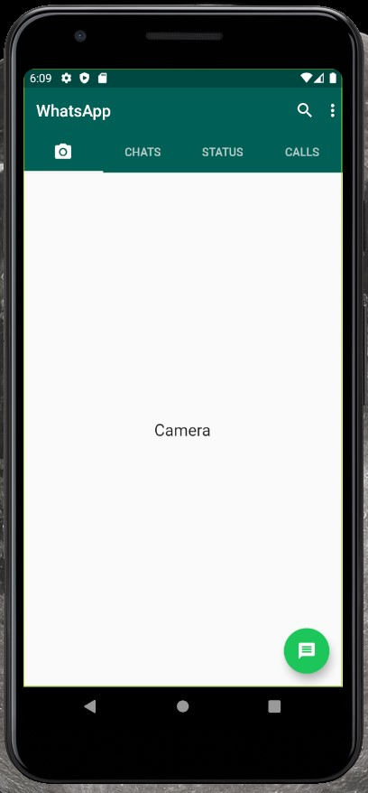
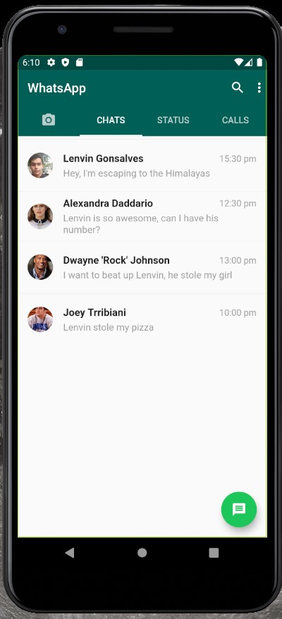
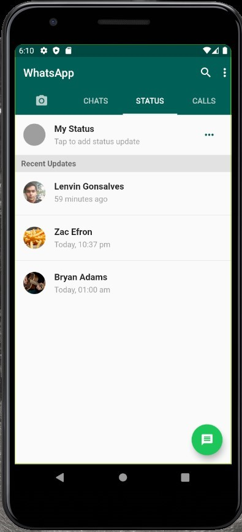
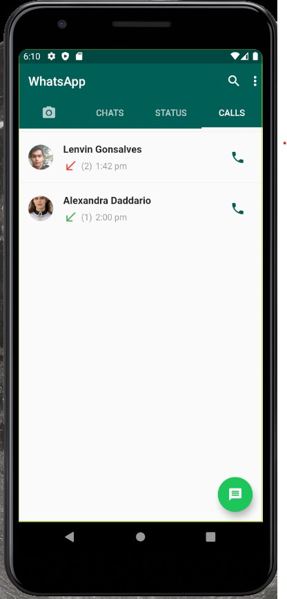

# Whatsapp clone - Flutter

UI (non functional) clone of Whatsapp, created in flutter

## Screenshots

## Getting Started

You need Flutter in order to build this app

## Authors

* **Lenvin Gonsalves**

## License

This project is licensed under the MIT License 

## Acknowledgments

* Pavan Kumar - MTECHVIRAL

